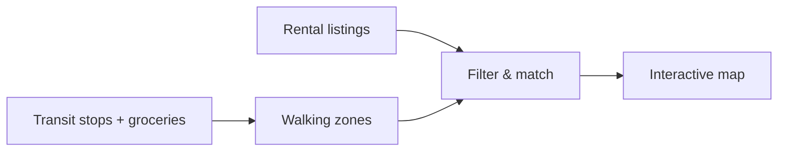

# Padestrian

A smarter apartment-hunting tool for people who commute on foot.

Most rental sites lean on generic “Walk Scores” that measure distance as the crow flies. That ignores fences, highways, missing sidewalks, and the routes you actually take—especially in winter. **Padestrian** uses real walking paths and official transit data so you can see which homes are genuinely steps from a bus stop, train station, and groceries—not just close on paper.

## How it works



1. **Gather listings** — Scan local rental sites for the latest apartments, prices, and addresses.
2. **Map the essentials** — Pin permanent bus stops, train stations, and major grocery stores from authoritative sources (GTFS + OSM).
3. **Calculate the real walk** — Use pedestrian routing (not straight-line distance) to build walking zones—for example, a 10-minute walk—from each stop and store.
4. **Filter the noise** — Keep only listings that fall inside **both** a transit zone and a grocery zone.
5. **Visualize** — Plot matches on an interactive, color-coded map so budget and commute fit in one glance.

## Why it matters

Finding a truly walkable place used to mean juggling rental tabs, Google Maps, and guesswork about winter walks. Padestrian removes that friction: affordable, car-free-friendly homes you can evaluate in one view.

## Project layout

```
padestrian/
├── .env.example      # API key template (copy to .env)
├── data/
│   ├── groceries.geojson   # Grocery / supermarket locations (OSM)
│   ├── GTFSExport/         # OC Transpo GTFS (gitignored, large)
│   ├── manifest.json       # Dataset metadata
│   └── README.md
└── README.md
```

## Setup

1. Copy the environment template and add your keys:

   ```bash
   cp .env.example .env
   ```

2. Place or refresh the OC Transpo GTFS export in `data/GTFSExport/` (see [data/README.md](data/README.md)). That folder is not committed because of size; `groceries.geojson` is included in the repo.

3. API keys (see `.env.example` for signup links):

   | Key | Role in Padestrian |
   |-----|---------------------|
   | **OpenRouteService** | Pedestrian routes and walking-time isochrones |
   | **Mapbox** | Interactive map and listing visualization |

Never commit `.env` or paste live tokens into the repo.

## Data sources

| Dataset | Source | Used for |
|---------|--------|----------|
| `data/groceries.geojson` | OpenStreetMap (Overpass) | Grocery walking zones |
| `data/GTFSExport/` | OC Transpo GTFS | Stop locations (bus, O-Train, etc.) |

Licenses: OSM data under [ODbL](https://www.openstreetmap.org/copyright); OC Transpo subject to their terms of use.

## Roadmap

| Phase | Goal | Status |
|-------|------|--------|
| **1 — Essentials map** | Stops from GTFS + groceries from GeoJSON | In progress — data on disk |
| **2 — Walking zones** | ORS isochrones (e.g. 10 min) around each stop and store | Planned |
| **3 — Listings** | Scrape or ingest Ottawa rental listings (addresses + price) | Planned |
| **4 — Filter** | Intersect listings with transit ∩ grocery zones | Planned |
| **5 — UI** | Mapbox map: zones, stops, stores, matching listings | Planned |

**Now:** Phase 1 foundations (OC Transpo GTFS, Ottawa grocery POIs, routing/map API keys). **Next:** extract stop coordinates from GTFS, generate pedestrian isochrones, then wire listings and the map.

## Status

Early build: data and configuration only—no scraper, isochrone pipeline, or map UI yet. The pieces above match the end-to-end flow Padestrian is designed for.
