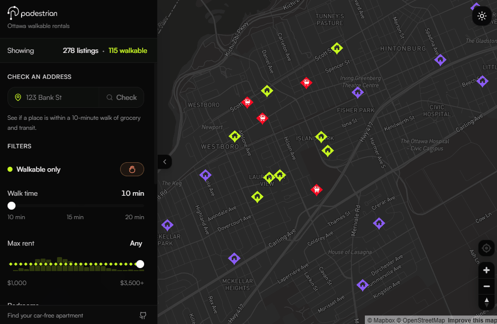
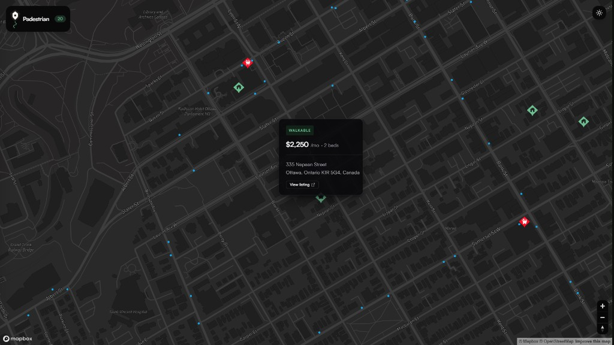
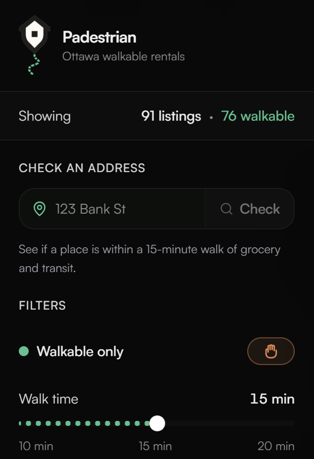
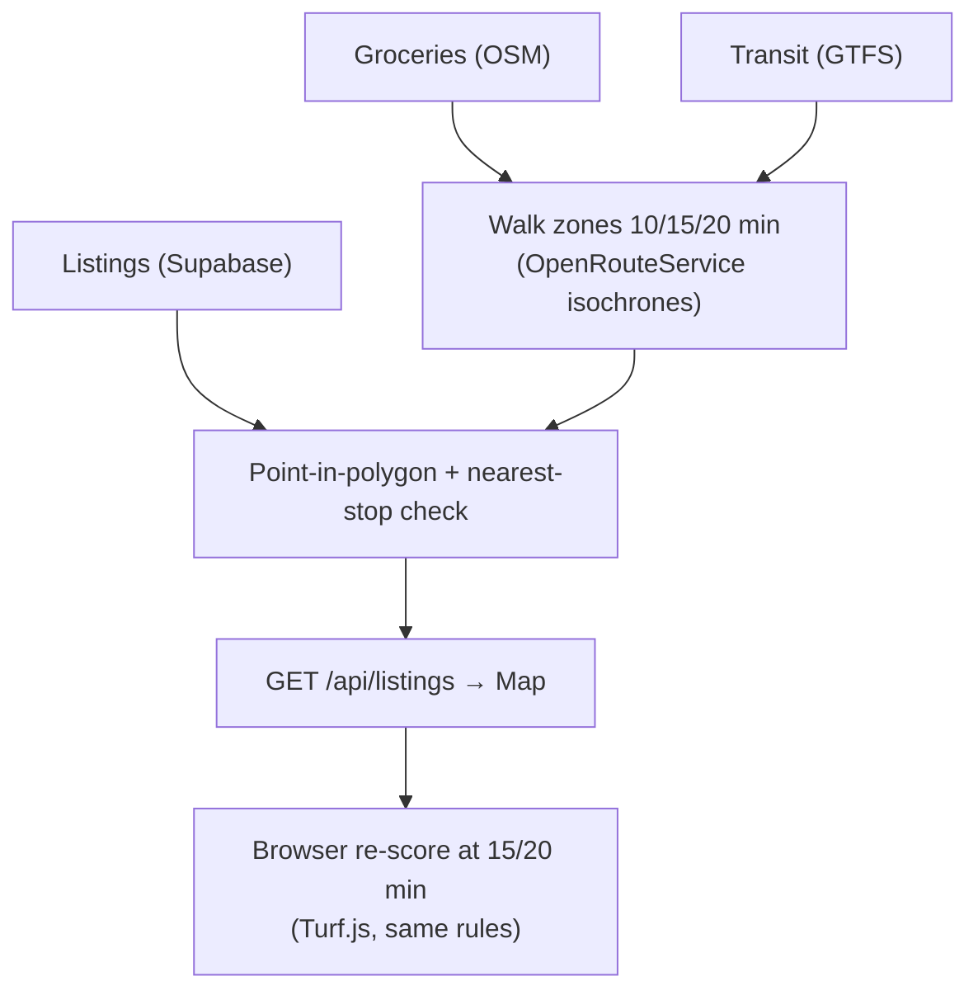

# padestrian

<p align="center">
  
</p>

> **Live app:** [padestrian.vercel.app](https://padestrian.vercel.app)  
> Ottawa rental map — filter by walkability to grocery and transit, browse Kijiji listings, or score any address.

**Find rentals you can actually live in without a car, on one map.**


**Where can I rent and still walk to the bus and the store?** padestrian is a full-stack Ottawa rental explorer built around that question — and a simple idea: **walkability should mean a real walk**, not a straight line on a map. Most listing sites hand you a generic score that ignores highways, missing sidewalks, and how long winter walks actually feel. This project scores each apartment using **pedestrian routing**, official **transit stop data**, and real **grocery locations**, then shows you the results instantly.

## Screenshots

**Demo** — sidebar + map together: walk-time filter, color-coded pins (walkable / grocery / transit), and live listing counts.



**Map** — color-coded rentals, groceries, transit stops, and listing cards with walkability badges.



**Sidebar** — logo, address check, walk-time slider, rent/bedroom filters, map layers, and Kijiji import.

<table>
  <tr>
    <td width="33%" align="center" valign="top">
      
    </td>
    <td width="33%" align="center" valign="top">
      
    </td>
    <td width="34%" align="center" valign="top">
      
    </td>
  </tr>
</table>

---

## Why this exists

Apartment hunting without a car usually means:

- Rental site in one tab, Google Maps in another  
- Guessing whether “15 minutes to transit” includes a fence, a parking lot, or a road with no sidewalk  
- No single view of **price + location + grocery + bus** at once  

padestrian puts that in one place: hover a pin, see rent and address, know at a glance if the listing is walkable to **both** transit and a full grocery store.

---

## Features

- **Interactive Mapbox map** with dark/light theme, rent and bedroom filters, **walk-time slider (10 / 15 / 20 min)**, and a “walkable only” toggle  
- **Live Kijiji listings** (count varies; GitHub Actions scrapes and prunes every 4 days) plus an optional **180-listing demo set** from City of Ottawa address points  
- **Color-coded house markers**: walkable, grocery-only, transit-only, or neither (updates when you change walk time)  
- **Grocery + transit + walk-zone layers** you can turn on and off  
- **Listing cards** on hover (price, beds/baths, address, Kijiji link when available)  
- **Check an address** or **Locate me** on the map: Ottawa autocomplete or GPS, then the same color-coded pin and walkability badge as rentals (saved in your browser until you clear it)  
- **Kijiji list** (chevron beside the layer toggle): browse all live ads, click to pan and open the listing card  
- **Personal Kijiji import** — paste listing URLs under the expanded Kijiji list; saved on **this device only** (`localStorage`), not the public catalog  
- **Automated listing refresh** via GitHub Actions every 4 days (scrape → prune dead ads → score → deploy); sidebar **last updated** badge reflects the latest run  
- **Local dev tools**: sidebar Kijiji refresh (prune / scrape) and owner CLI `import-kijiji --to-db` for the global catalog

---

## Tech stack

| Layer | Tools |
|-------|--------|
| Frontend | Next.js 16, React 19, Mapbox GL, Tailwind, Turf.js (client walk scoring), Supabase |
| **Backend / data** | Python 3.11+, Shapely, httpx, Playwright (Kijiji), Supabase (PostGIS listings) |
| **Routing & map APIs** | OpenRouteService (walk isochrones, CLI), Mapbox (tiles + geocoding + address autocomplete) |
| **Data sources** | OC Transpo GTFS, OpenStreetMap groceries, City of Ottawa address points |

---

## How it works



1. **Listings** live in **Supabase** (scraped Kijiji + demo municipal coords); the map loads them via `/api/listings`.
2. **Groceries** come from OpenStreetMap; **transit stops** from OC Transpo GTFS.
3. **Walk zones** are built with OpenRouteService: pedestrian routing for a chosen time budget (default **10 min**; **15** and **20** in the UI), drawn as polygons around each store and curated transit hubs.
4. Each listing is scored: near grocery? near transit? **eligible** only when both are true. Batch scoring runs at 10 min into the database; moving the **walk-time slider** re-scores all pins in the browser with the same rules.
5. The Next.js app paints pins by category. `public/data/listings-scored.geojson` remains a static fallback if the API is unavailable.
6. **Custom addresses** (sidebar or Locate me) geocode in the browser via Mapbox, score with the selected walk budget, and merge into the listings layer as `source: "custom"` pins (browser `localStorage` only).
7. **Personal Kijiji imports** (paste a URL in the sidebar) scrape via `POST /api/import-kijiji`, score server-side, and save as `kijiji-saved` pins in `localStorage` — visible only to you on this browser.

Walk zones and stops stay as GeoJSON on disk; only the **listing catalog** moved to Postgres.

---

<details>
<summary><strong>Getting started</strong></summary>

<br />

**Requirements:** Node 18+, Python 3.11+, Mapbox and OpenRouteService API keys.

```bash
cp .env.example .env
# ORS_API_KEY, MAPBOX_ACCESS_TOKEN in .env
# SUPABASE_URL, SUPABASE_SERVICE_ROLE_KEY in .env
# NEXT_PUBLIC_MAPBOX_TOKEN in .env.local (same Mapbox token)

python -m venv .venv && .venv\Scripts\activate   # source .venv/bin/activate on macOS/Linux
pip install -e .

# One-time: run supabase/migrations/001_listings.sql in Supabase SQL editor, then:
python -m padestrian seed-db
python -m padestrian filter-listings          # write 10-min scores to Supabase

python -m padestrian build-essentials
python -m padestrian build-transit-hubs          # curated hub stops for transit zones
python -m padestrian validate-listings
python -m padestrian build-zones              # 10-min grocery zones (default)
python -m padestrian build-zones --transit --no-groceries   # 10-min hub transit zones
python -m padestrian build-zones --minutes 15 # optional: 15-min zones for the slider
python -m padestrian filter-listings          # score at 10 min → listings-scored.geojson

npm install && npm run dev
```

Open **http://localhost:3000**. Dataset details, Kijiji scrape/prune workflow, and zone rebuild notes: [data/README.md](data/README.md).

</details>

---

<details>
<summary><strong>CLI reference</strong></summary>

<br />

| Command | What it does |
|---------|----------------|
| `build-essentials` | Export transit stops, grocery points, and transit hubs |
| `build-transit-hubs` | Export curated OC Transpo hub stops → `transit-hubs.geojson` |
| `fetch-groceries` | Pull supermarkets from OpenStreetMap |
| `build-zones` | Generate walk polygons (`--minutes 10` default; `--transit` uses hubs) |
| `filter-listings` | Score every listing at 10 min (Supabase or GeoJSON) |
| `seed-db` | Import `listings.json` into Supabase (one-time bootstrap) |
| `export-listings` | Export active Supabase listings to GeoJSON |
| `validate-listings` | Validate catalog + export map layer |
| `seed-listings` | Generate the demo rental set |
| `scrape-listings` | Import ads from Kijiji |
| `import-kijiji` | Import specific Kijiji URLs (stdout GeoJSON; `--to-db` for owner catalog) |
| `prune-kijiji` | Drop listings no longer active on Kijiji |
| `backfill-bathrooms --fetch` | Fill missing Kijiji bath counts from live ad pages |
| `validate-scoring` | Compare scores to a hand-labeled test CSV |
| `check-mapbox` | Sanity-check your Mapbox token |

</details>

---

## Project layout

```text
padestrian/     Python CLI (ingest, zones, scoring, scrape)
components/     Map UI (filters, popups, address search, layers)
lib/            Browser geocoding, walk scoring, personal Kijiji import
app/            Next.js entry + API routes (`/api/listings`, `/api/import-kijiji`)
data/           Source + generated GeoJSON
public/data/    Served to the browser (/data/… in the app)
public/images/  Map markers, logos, README screenshots
```
