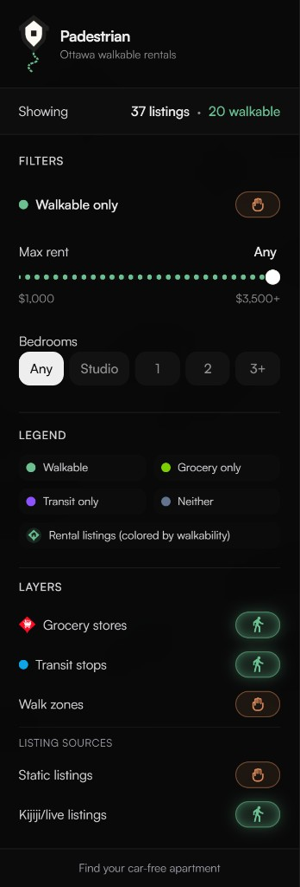
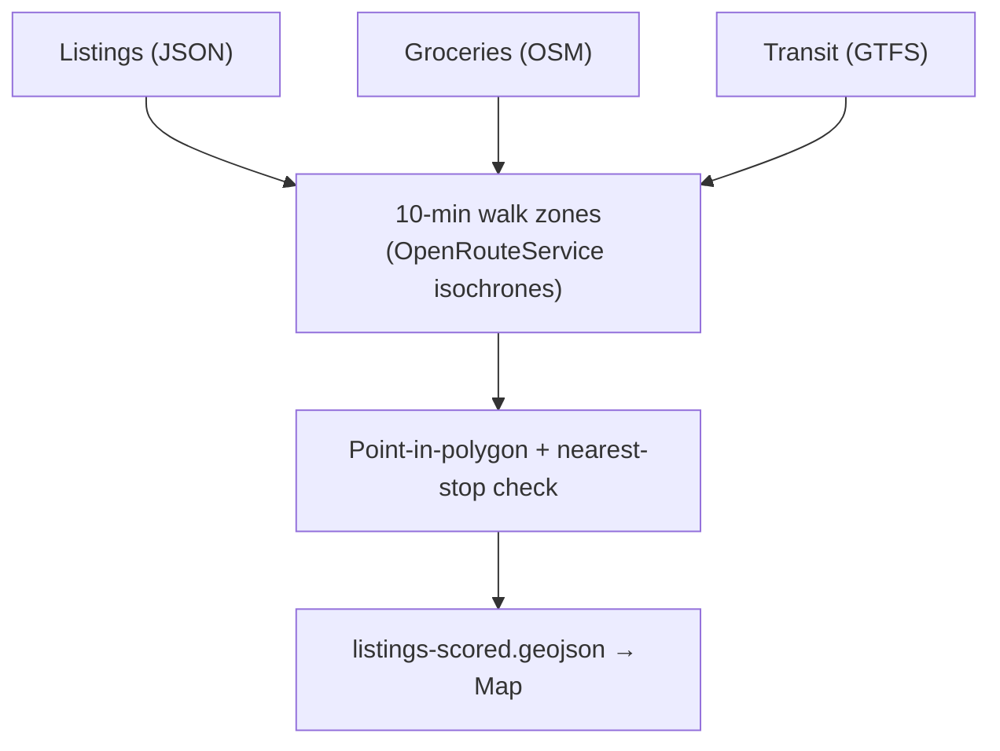

# Padestrian

Live demo → [padestrian website](https://padestrian.vercel.app)


**Find rentals you can actually live in without a car, on one map.**

**Where can I rent and still walk to the bus and the store?** Padestrian is a full-stack Ottawa rental explorer built around that question — and a simple idea: **walkability should mean a real walk**, not a straight line on a map. Most listing sites hand you a generic score that ignores highways, missing sidewalks, and how long winter walks actually feel. This project scores each apartment using **pedestrian routing**, official **transit stop data**, and real **grocery locations**, then shows you the results instantly.

## Screenshots

<table>
  <tr>
    <td width="65%" valign="middle" align="center">
      <div align="left">
        <strong>Map</strong>: color-coded rentals, groceries, transit stops, and a listing card with walkability badge
      </div>
      <br />
      
    </td>
    <td width="35%" valign="middle">
      <strong>Filters &amp; layers</strong>: rent, bedrooms, walkable-only toggle, legend, and grocery/transit/Kijiji sources<br /><br />
      
    </td>
  </tr>
</table>

---

## Why this exists

Apartment hunting without a car usually means:

- Rental site in one tab, Google Maps in another  
- Guessing whether “15 minutes to transit” includes a fence, a parking lot, or a road with no sidewalk  
- No single view of **price + location + grocery + bus** at once  

Padestrian puts that in one place: hover a pin, see rent and address, know at a glance if the listing is walkable to **both** transit and a full grocery store.

---

## Features

- **Interactive Mapbox map** with dark/light theme, rent and bedroom filters, and a “walkable only” toggle  
- **~180 demo listings** placed on real City of Ottawa address coordinates (not random pins)  
- **Color-coded house markers**: walkable, grocery-only, transit-only, or neither  
- **Grocery + transit layers** you can turn on and off  
- **Listing cards** on hover (price, beds/baths, address, Kijiji link when available)  
- **Check an address** in the sidebar: Ottawa autocomplete, then the same color-coded house pin and walkability badge as rentals (saved in your browser until you clear it)  
- **Kijiji list** (chevron beside the layer toggle): browse all live ads, click to pan and open the listing card  
- **Optional live Kijiji import** via the Python CLI (batch scrape → score → map)

---

## How it works



1. **Listings** land on the map with real lat/lon from municipal address points (demo set) or imported Kijiji ads.  
2. **Groceries** come from OpenStreetMap; **transit stops** from OC Transpo GTFS.  
3. **Walk zones** are built with OpenRouteService: actual sidewalk/path routing for a **10-minute** budget, drawn as polygons around each store (and optionally stops).  
4. Each listing is scored: near grocery? near transit? **eligible** only when both are true.  
5. The Next.js app loads the scored GeoJSON and paints pins by category.  
6. **Custom addresses** (sidebar) geocode in the browser via Mapbox, score with the same grocery-zone + nearest-transit rules as the Python CLI (Turf.js point-in-polygon), and merge into the listings layer as `source: "custom"` pins.

No database. Datasets are GeoJSON and JSON on disk, rebuilt with a CLI and served to the frontend.

---

## Tech stack

| Layer | Tools |
|-------|--------|
| **Frontend** | Next.js 16, React 19, Mapbox GL, Tailwind, Turf.js (client walk scoring) |
| **Backend / data** | Python 3.11+, Shapely, httpx, Playwright (Kijiji) |
| **Routing & map APIs** | OpenRouteService (walk isochrones, CLI), Mapbox (tiles + geocoding + address autocomplete) |
| **Data sources** | OC Transpo GTFS, OpenStreetMap groceries, City of Ottawa address points |

---

<details>
<summary><strong>Getting started</strong></summary>

<br />

**Requirements:** Node 18+, Python 3.11+, Mapbox and OpenRouteService API keys.

```bash
cp .env.example .env
# ORS_API_KEY, MAPBOX_ACCESS_TOKEN in .env
# NEXT_PUBLIC_MAPBOX_TOKEN in .env.local (same Mapbox token)

python -m venv .venv && .venv\Scripts\activate   # source .venv/bin/activate on macOS/Linux
pip install -e .

python -m padestrian build-essentials
python -m padestrian validate-listings
python -m padestrian build-zones
python -m padestrian filter-listings

npm install && npm run dev
```

Open **http://localhost:3000**. Dataset details, Kijiji scrape/prune workflow, and zone rebuild notes: [data/README.md](data/README.md).

</details>

---

## CLI reference

| Command | What it does |
|---------|----------------|
| `build-essentials` | Export transit stops + grocery points |
| `fetch-groceries` | Pull supermarkets from OpenStreetMap |
| `build-zones` | Generate 10-minute walk polygons |
| `filter-listings` | Score every listing → `listings-scored.geojson` |
| `validate-listings` | Validate catalog + export map layer |
| `seed-listings` | Generate the demo rental set |
| `scrape-listings` | Import ads from Kijiji |
| `prune-kijiji` | Drop listings no longer active on Kijiji |
| `backfill-bathrooms --fetch` | Fill missing Kijiji bath counts from live ad pages |
| `validate-scoring` | Compare scores to a hand-labeled test CSV |
| `check-mapbox` | Sanity-check your Mapbox token |

---

## Project layout

```text
padestrian/     Python CLI (ingest, zones, scoring, scrape)
components/     Map UI (filters, popups, address search, layers)
lib/            Browser geocoding + walk scoring
app/            Next.js entry
data/           Source + generated GeoJSON
public/data/    Served to the browser (/data/… in the app)
public/images/  Map markers + README screenshots
```
